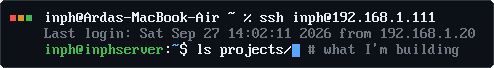
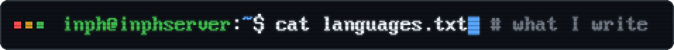
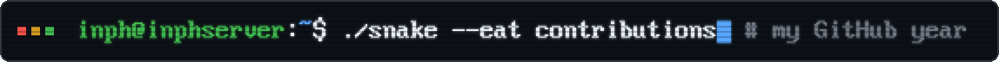

 

Into Linux and self-hosted stuff. I mostly build tools for myself, 
then keep rebuilding them until I understand how every part works.

<h3></h3>

<table>
  <tr>
    <td width="33%" align="center" valign="top">
      <h3><a href="https://github.com/imInph/inphub">inphub</a></h3>
      v4.1
      
My personal dashboard for money, tasks, habits, goals, notes and focus sessions. It runs on my own machine and has an optional AI chat through Claude, Ollama or LM Studio.

       
      
      
      
        
      <a href="https://iminph.github.io/inphub-lite/"><b>Try inphub-lite →</b></a>
    </td>
    <td width="33%" align="center" valign="top">
      <h3><a href="https://github.com/imInph/inphner">inphner</a></h3>
      v1.2
      
A speedcubing timer and algorithm trainer, like csTimer with a calmer interface. It works offline, keeps everything in your browser and can connect to a Stackmat or a GAN smart cube.

      
      
        
      <a href="https://iminph.github.io/inphner/"><b>Try it →</b></a>
    </td>
    <td width="33%" align="center" valign="top">
      <h3><a href="https://github.com/imInph/inphish">inphish</a></h3>
      v6.1
      
A UCI chess engine you can load into any chess GUI. It runs a port of Stockfish 19's search and its NNUE network on its own board and move generator. Every release is tested in matches against other engines.

      
      
        
      <a href="https://github.com/imInph/inphish/releases/latest"><b>Download →</b></a>
    </td>
  </tr>
</table>

 

<h3></h3>

My repos also have C, Java, PHP and Verilog in them. I don't know those yet, so they're not listed here.

  

<h3></h3>

 

  

<h3></h3>

<picture>
  <source media="(prefers-color-scheme: dark)" srcset="https://raw.githubusercontent.com/imInph/imInph/output/snake-dark.svg" />
  <source media="(prefers-color-scheme: light)" srcset="https://raw.githubusercontent.com/imInph/imInph/output/snake-light.svg" />
  
</picture>

  

The headings are drawn in the 8x16 font my <a href="https://github.com/imInph/inphex-monolyth">Tang Nano console</a> prints over HDMI.

